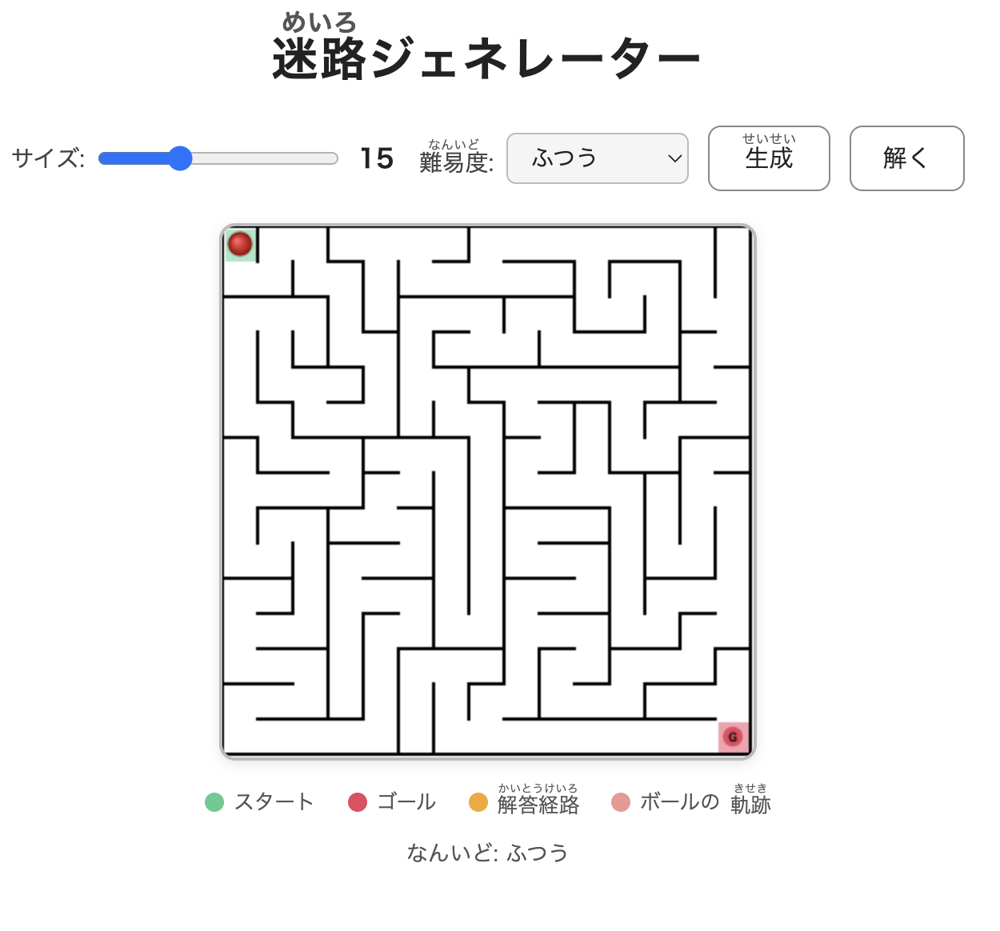

# けいえんの迷路（めいろ）ジェネレーター

ランダムで迷路を生成して、ボールを転がして遊べるWebアプリです。

## 遊び方

1. **サイズ**と**難易度**を選んで「生成」ボタンを押す
2. 指（またはマウス）でボールをゴールまで転がす
3. 赤い線がボールの軌跡として残る、戻ると消える
4. 「解く」ボタンで正解ルートを表示できる

## 難易度

| 難易度 | 特徴 |
|--------|------|
| かんたん | DFS・長めの通路・分岐少なめ |
| ふつう | DFS・ランダム |
| むずかしい | Prim法・短い行き止まりが多く分岐だらけ |
